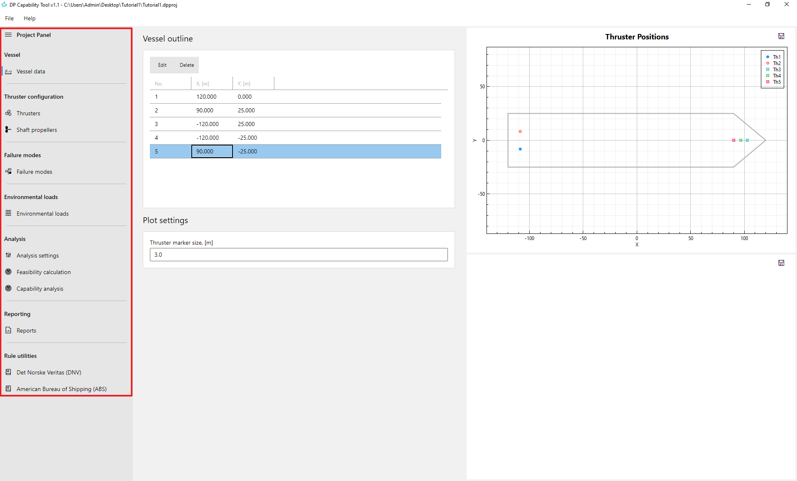
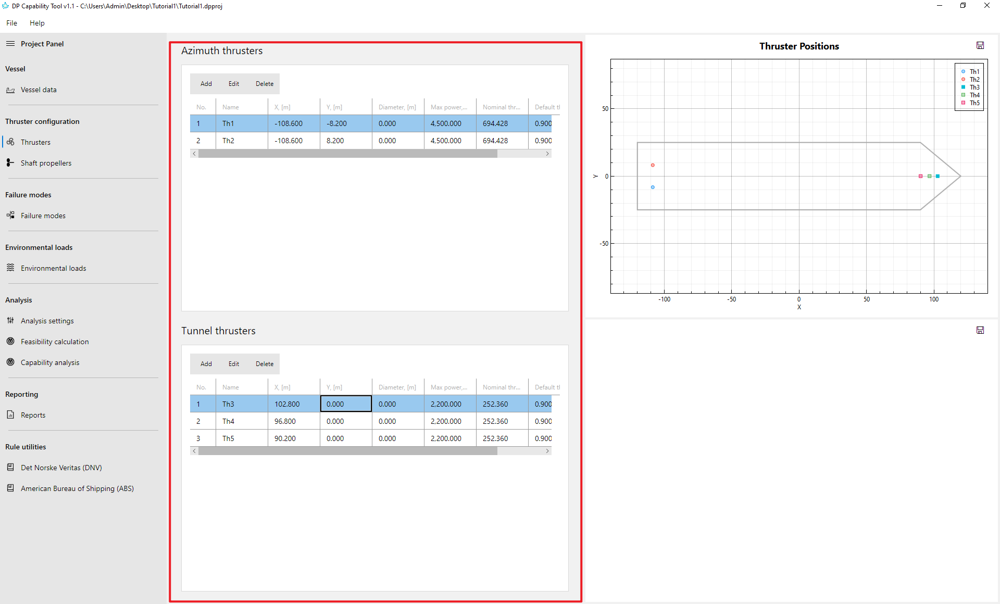
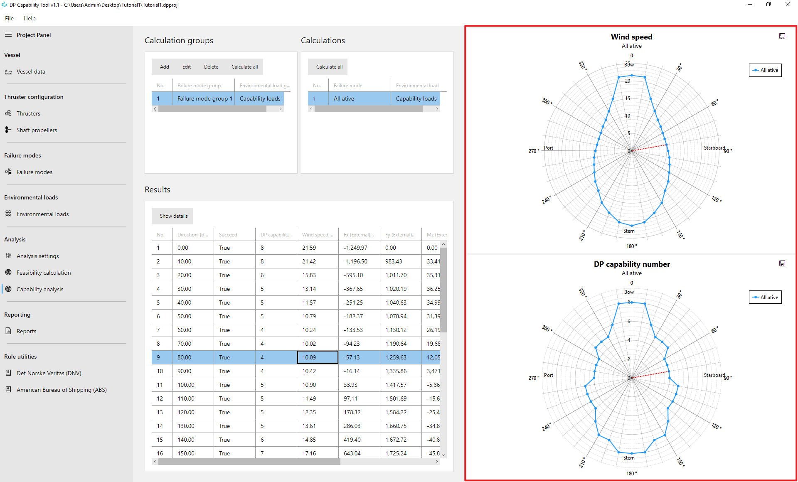
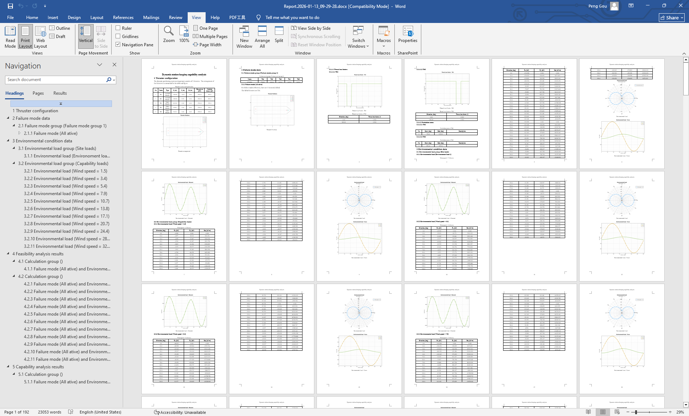



**DP Capability Tool** is a professional engineering software designed to evaluate the **station-keeping performance of dynamically positioned (DP) vessels** under combined environmental loads and defined failure scenarios. The tool supports feasibility checks, DP capability assessment, and standards-aligned analysis through an intuitive, project-based workflow.

---

## ⭐ Key Features at a Glance


  

  

  

  

  

  


---

## 🧮 Analysis Functions

### Feasibility Calculation
Determine whether a valid thrust allocation solution exists for a given environmental condition while minimizing total power consumption.

### DP Capability Analysis
Assess the **maximum environmental loads** a vessel can withstand while maintaining station-keeping, supporting DP capability plots and operability assessments.

---

## ⚙️ DP System & Thruster Modeling

### Comprehensive Thruster Configuration
Model a wide range of thruster types, including:
- Azimuth thrusters  
- Tunnel thrusters  
- Shaft propellers  

Each thruster can be configured with position, orientation, power limits, and operational constraints.

### Robust Thrust Allocation
Apply robust thrust allocation algorithms to realistically distribute thrust forces and moments while respecting physical and operational limitations.

---

## 🌊 Environmental Load Modeling

### Multi-Source Environmental Loads
Accurately model external forces acting on the vessel, including:
- Wind loads  
- Wave loads  
- Current loads  

These loads form the basis for both feasibility and capability calculations.

---

## ⚠️ Failure & Scenario Analysis

### Failure Mode Definition
Simulate DP system performance under defined failure conditions, such as:
- Thruster failures  
- Power loss scenarios  
- Forbidden zones and thrust limitations  

This supports intact and failure case evaluations in accordance with DP practice.

---

## 📸 Screenshots

### Project-Based Workflow

*Organize vessels, environments, DP systems, and analysis cases in a structured project tree.*

### Thruster & DP System Configuration

*Define thruster positions, orientations, and operational limits through a dedicated configuration interface.*

### Capability & Feasibility Plots

*Rose plots visualize vessel capability under different environmental load directions.*

### Reporting Output

*Generate comprehensive, ready-to-use engineering reports containing figures and tables.*

---

## 📊 Visualization & Results

### Capability and Feasibility Plots
Generate clear visual outputs, including **rose plots**, to illustrate vessel performance under different load directions and environmental conditions.

### Interactive Plot Views
Inspect analysis results interactively to better understand thrust utilization, margins, and directional limitations.

---

## 🧰 Engineering Utilities & Rules

### Built-in Rule Utilities
Includes calculation utilities aligned with industry guidance and classification society practices, such as:
- DNV DNV-ST-0111 Assessment of station keeping capability of dynamic positioning vessels
- ABS Guide for Dynamic Positioning Systems  

These utilities assist with consistent and standards-aware analysis.

---

## 🖥 User Interface & Project Management

### Project-Based Workflow
Organize all models, configurations, and results within a structured project system.

### Interactive Graphical User Interface
The software provides:
- Application menu and toolbars  
- Project panel for model management  
- Dedicated model and plot views  

This design improves efficiency and usability for engineering workflows.

---

## ✅ Typical Applications

- DP capability assessment for offshore vessels  
- Operability and environmental limit evaluation  
- Failure mode and redundancy studies  
- Engineering documentation and reporting  

---
