

## 1 Introduction

Dynamic positioning is a technology used to automatically maintain a vessel's position and heading without the need for traditional anchoring. This capability is particularly important for offshore operations such as drilling, construction, and maintenance, where precise positioning is essential. Dynamic station-keeping capability analysis is a crucial aspect of assessing the performance and reliability of dynamic positioning (DP) vessels. 

DP Capability Tool is a program to assess the station keeping capabilities of a vessel, with respect to intact condition and relevant failures. These capabilities are associated with the vessel’s mission specific operational conditions. The program applies the robust thrust allocation algorithm to give realistic station keeping capability in the different scenarios. The interactive user interface makes the modeling much more convenient and efficient. The one-stop reporting function generate the report for a whole project with all the data in forms of tables and figures.

DP Capability Tool represents the modern design of capability analysis tools for the station-keeping performance of DP vessels. 

## 2 Theory

A dynamic positioning system is able to control the position and heading of a vessel by using thrusters that are constantly active and automatically balance the environmental forces (wind, waves, current etc.). Environmental forces tend to move the vessel off the desired position while the automatically controlled thrust balances those forces and keeps the vessel in position. The thrust allocation problem of the thrusters is restricted to the motions in the horizontal plane of the vessel, including surge, sway and yaw which are controlled by the forces F_x, F_y and the moment M_z.

Everything but the environmental directions shall be given in a right-hand coordinate system with the x-axis pointing forward, y-axis pointing to port and z-axis upwards. The origin is located at L_pp/2, center line and keel.

Below show the sign conventions of F_x, F_y and M_z, as well as the vessel coordinate system.

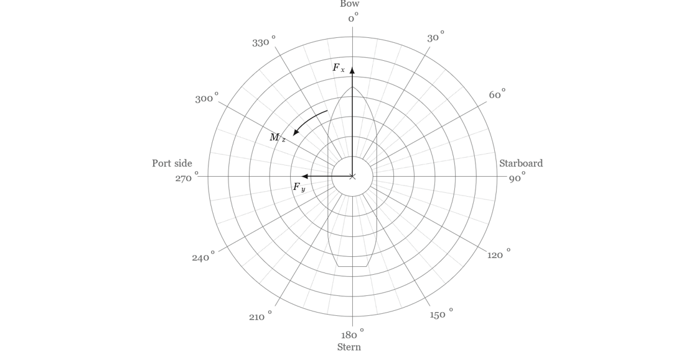
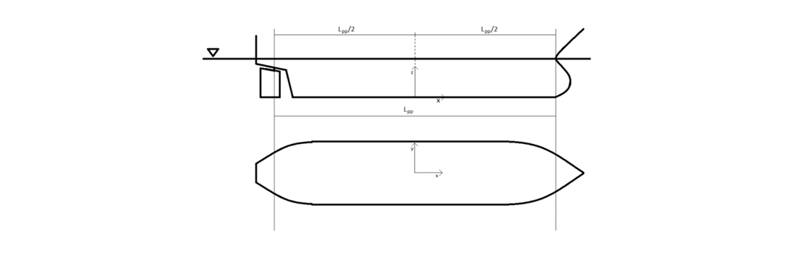

The forces and moment applied to the vessel can be grouped in to two sources: the environmental loads and the thruster system.

### 2.1 Environmental loads

Environmental loads are the forces and moments acting on a vessel due to its external environment. For vessels operating in dynamic positioning (DP), which use thrusters to maintain their position and heading without anchors, it is crucial to understand and account for these loads to ensure safe and efficient operation. 

Environmental directions are defined to come from direction clockwise. 0 deg is for head seas and 90 deg is for the starboard side.

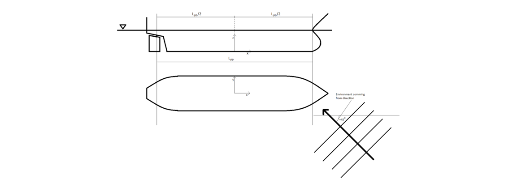

These loads are mainly caused by wind, currents and waves.

#### 2.1.1 Wind

Wind loads are caused by the movement of air across the vessel's superstructure and sails (if any). They can be significant, especially for large vessels with a lot of windage area. 

Wind loads consist of the following 3 components:

#### 2.1.2 Current

Current loads are caused by the movement of water through which the vessel is moving. They can cause the vessel to drift off its desired position and can also make it more difficult to maneuver.

Wind loads consist of the following 3 components:

#### 2.1.3 Wave

Wave loads are caused by the motion of the water around the vessel. They can be very complex and vary depending on the wave height, period, and direction. Wave loads can cause the vessel to heave, pitch, roll, surge, sway, and yaw. In the DP capability analysis, only horizontal components of wave loads are of interest. 

Wind loads consist of the following 3 components:

### 2.2 Thruster system

Thruster can exert forces on the vessel and are used by the DP system to control its position. Most propulsion devices use a rotating propeller to generate thrust. The effective thrust force F_(effective, thruster i) of the i-th thruster can be represented by its components along the x and y axes denoted by F_(x,thruster i) and F_(y,thruster i). With the coordinate of the thruster (x_(thruster i) and y_(thruster i)), M_(z,thruster i) can be calculated as:

The effective thrust force from a thruster shall be calculated as 

Where F_nominal is the nominal thrust and β_T is the thrust loss factor. The estimation of thrust loss factor can refer to DNVGL-ST-0111 2018 Assessment of station keeping capability of dynamic positioning vessels. 

The total thrust force of the DP system can be summarized as

While there are a lot of different thrusters available for different application, azimuth thruster, tunnel thruster and shaft propeller are the most basic types for the dynamic positioning system.

#### 2.2.1 Azimuth thrusters

Azimuth thrusters can rotate the full 360 degrees to generate thrust in any direction. They are often fitted with a duct around the propeller to reduce the cavitation for a better efficiency. To avoid an azimuth thruster from blowing at the skeg or the other working thrusters, forbidden zones can be introduced to forbid the azimuth thruster to generate thrust in the range of the given directions. In general, the thrust force components F_x and F_y are not zero.

#### 2.2.2 Tunnel thrusters

Tunnel thrusters, positioned at the bow or stern of a vessel to maximize their impact, are capable of producing transverse thrust force. The thrust force from a tunnel thruster is characterized by a zero longitudinal component F_x, and with only the transverse component F_y contributing to the dynamic positioning of the vessel.

#### 2.2.3 Shaft propeller and rudders

Propulsion in vessels is primarily facilitated by shaft propellers and rudders, which, under specific conditions, can integrate into the Dynamic Positioning (DP) system. The contemporary DP systems leverage shaft propellers and rudders to enhance their capabilities. Rudder performance is defined by longitudinal and transverse force factors relative to rudder angles. When a shaft propeller is linked to a rudder, it can generate thrust forces in both longitudinal and transverse directions.

### 2.3 Thrust allocation

The thrust allocation in the DP system should be conducted to determine the thrust and azimuth direction of each thruster so that the environmental loads are balanced.

## 3 User interface

The user interface consists of 5 main area, including

- Application title bar
- Application menu bar
- Project panel
- Model view
- Plot view

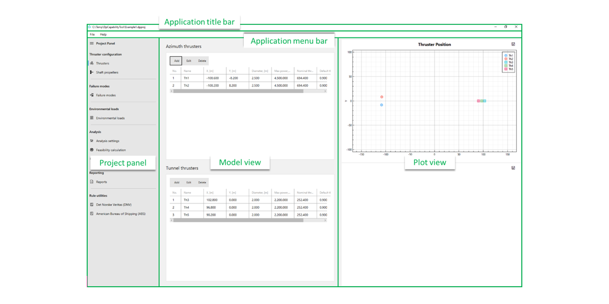

### 3.1 Application title bar

Application title bar is on the top of the user interface, showing the basic information of the project, such as the path of the project file.

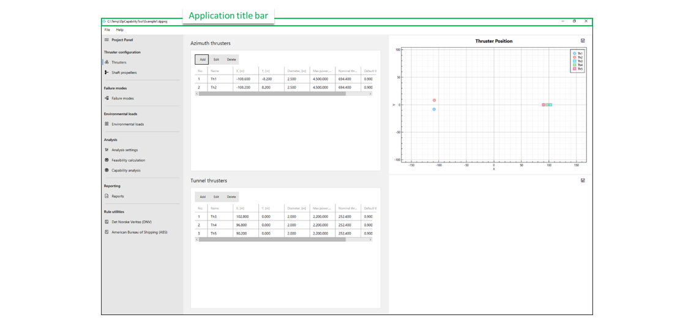

### 3.2 Application menu bar

Application menu bar is composed of drop-down menus that contain a list of grouped menu items for the functionality related to the application or a project.

File menu contains the functionality to create/open/save a project. The recent projects can be remembered and reopened from the Open Recent list.

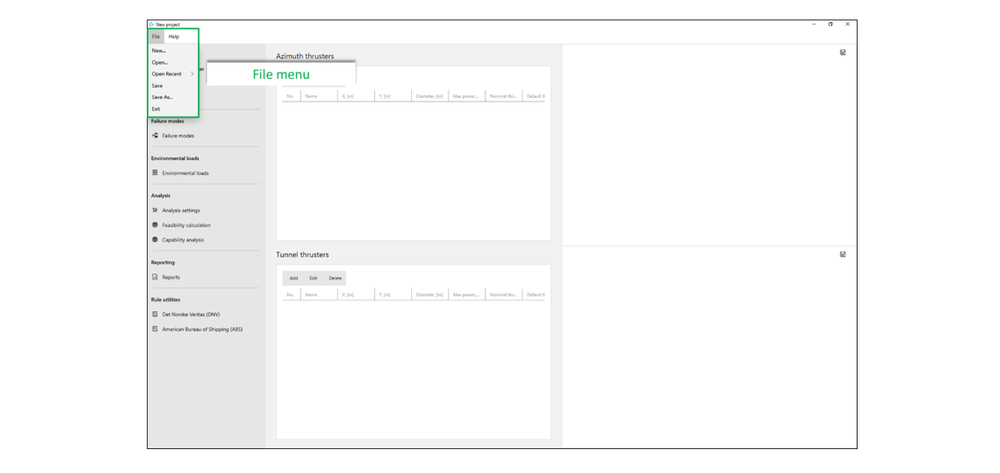

The user manual, license information and the About can be found in the Help menu. 

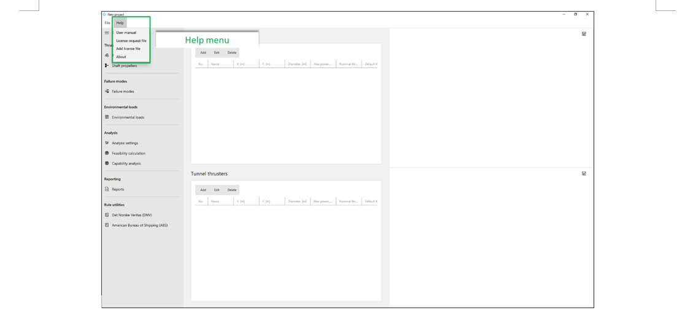

### 3.4 Model view

Model view is a container for detailed data of a certain section of the Project panel. When a section in the Project panel is clicked, the Model view will switch to the corresponding view for the models and settings. 

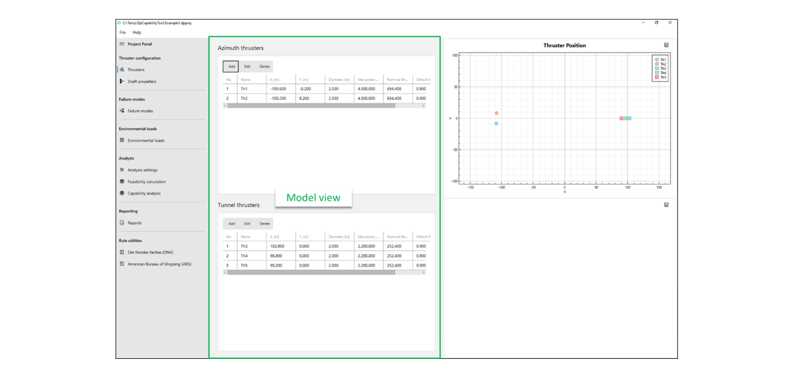

### 3.5 Plot view

Plot view can show up to 2 plots for the model/result in the context. By clicking the Save button on the top-right corner, the user could save the plot to a local image file.

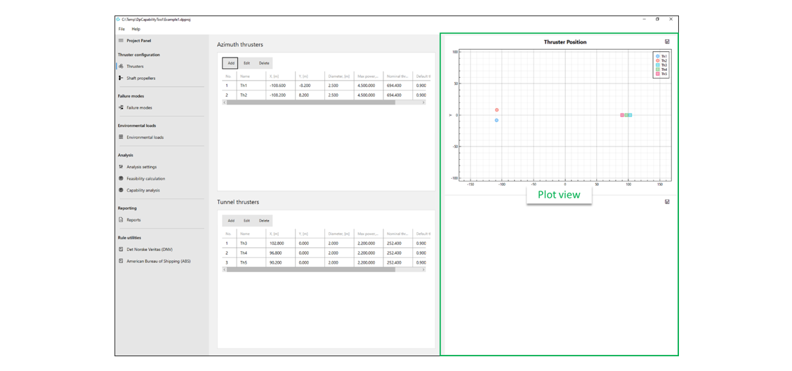

### 3.6 Project panel

Project panel is at the left of the main area of the user interface and contains all the models and utilities of a project, such as thruster configuration, failure modes, environmental loads, analysis, reporting and rule utilities. In general, the user could follow the order of sections in Project panel for modelling, analyzing and reporting. 

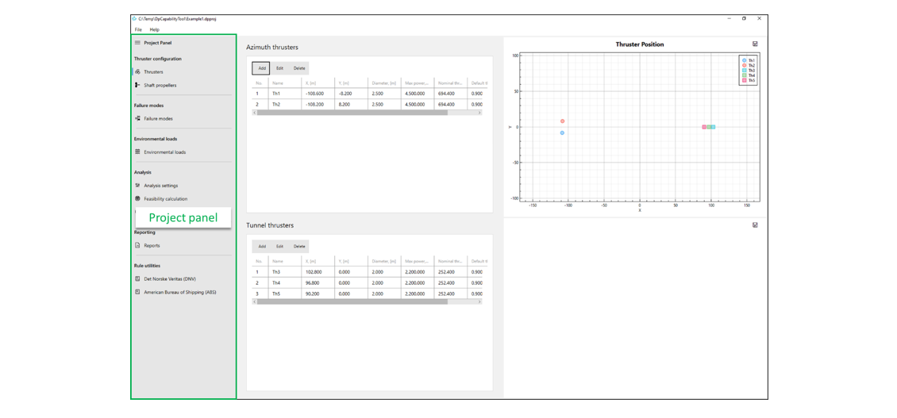

#### 3.6.1 Thruster configuration

The thruster configuration of a DP system depends on the specific requirements of the vessel and its intended operations. 3 types of thrusters are supported in the program, including

- Azimuth thrusters
- Tunnel thrusters
- Shaft propellers

The data of azimuth thrusters and tunnel thrusters are specified in the Thrusters section, while the Shaft propellers section for shaft propellers with/without rudder.

##### 3.6.1.1 Thrusters

Azimuth thrusters and tunnel thrusters can be added to the thruster configuration.

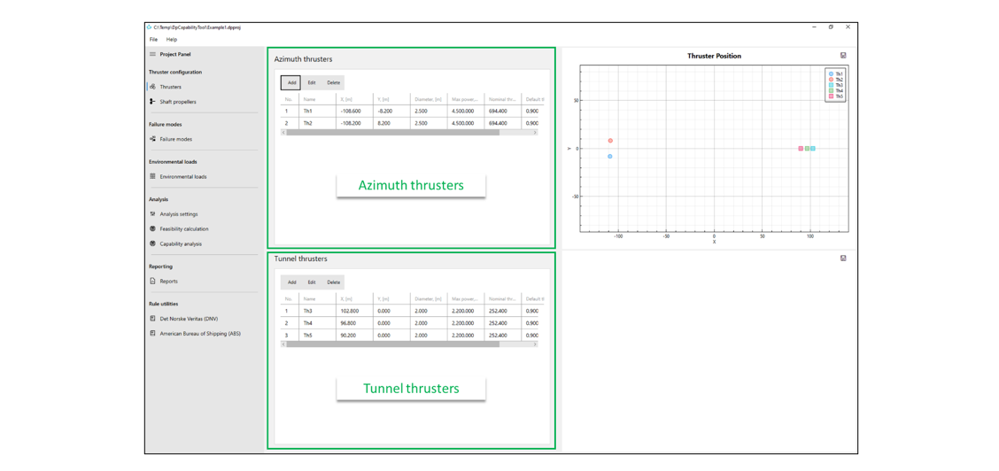

The azimuth thrusters and tunnel thrusters are listed in the data grids. The user can add/edit/delete records with the buttons in the corresponding actions bars.

For an azimuth thruster, the required properties are listed in the table below.

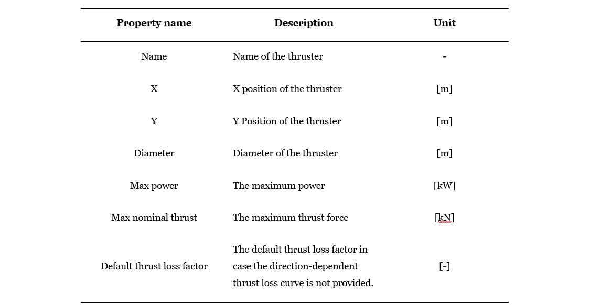

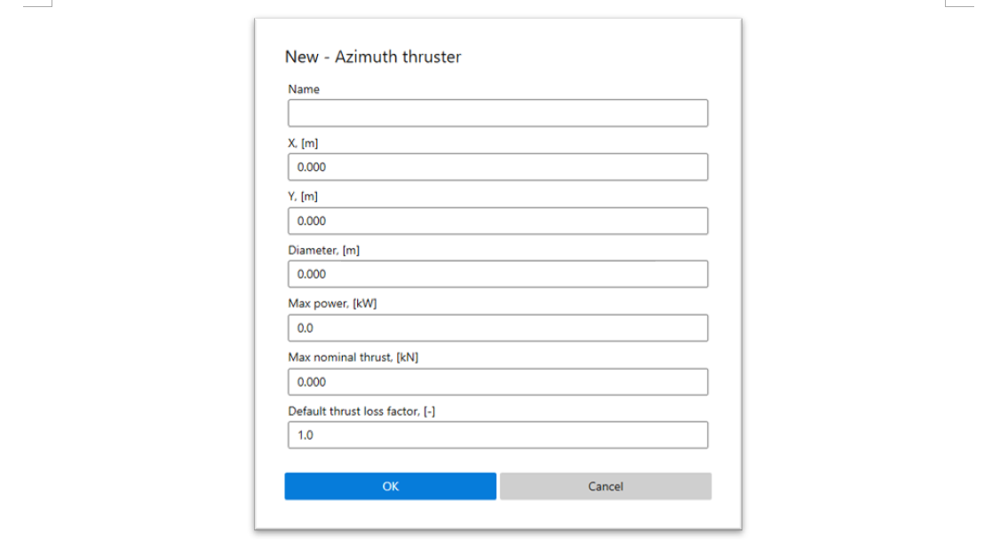

The properties of a tunnel thruster are almost the same as those of an azimuth thruster, except the Y position is 0, as tunnel thrusters are mounted in the center line of a vessel in most of the cases. Tunnel thrusters only generate transverse thrust.

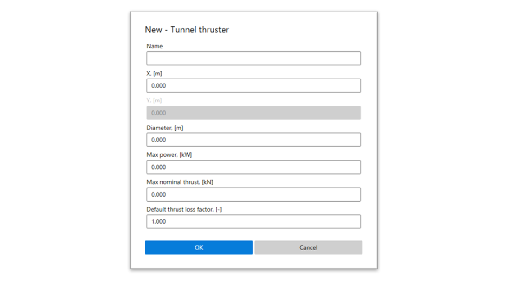

Plot view shows the thruster positions. When a thruster is selected in the list, it will be highlighted in the plot.

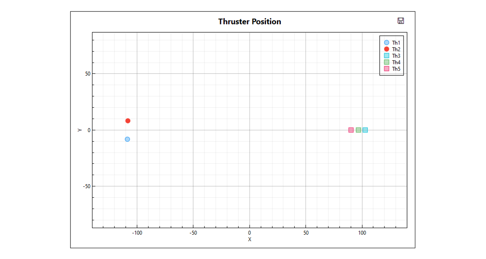

##### 3.6.1.2 Shaft propellers

Shaft propellers are mainly used for the propulsion of the ship and they are not always part of the DP system. Modern DP systems can use shaft propeller/rudder pair to increase the DP capability. A shaft/rudder pair can generate thrust in the longitudinal and transverse direction. 

The properties of a shaft propeller are show in the figure below.

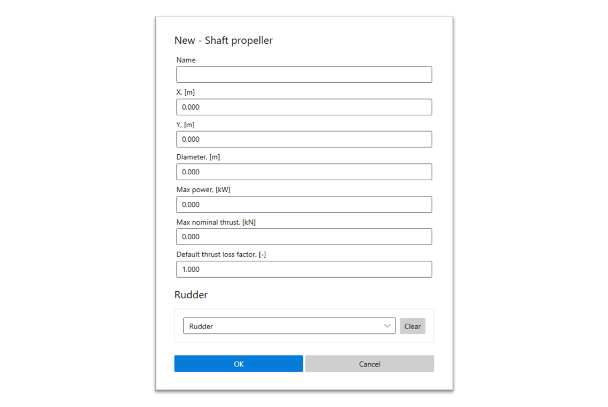

The characteristics of the rudder are given by the longitudinal and transverse force ratios. When adding a rudder to the model, only the name is required to specified in the dialog.

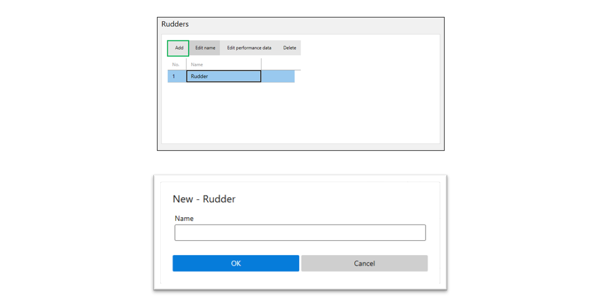

The rudder performance data can be set by clicking the Edit performance data button. 

The dialog is a general approach for the data table of a list of records. One row in the text area is for a record with the parameters separated by Space/Comma/Tab. Each row must have the same number of parameters (columns) and the definition of each parameter is shown on the top of text area. 

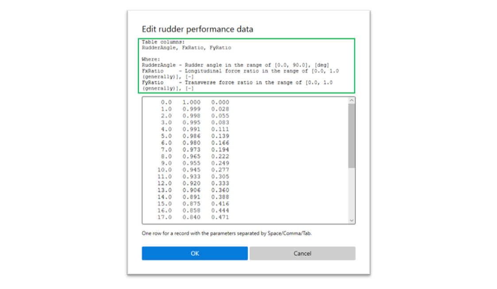

A record of rudder performance data has 3 parameters, which are

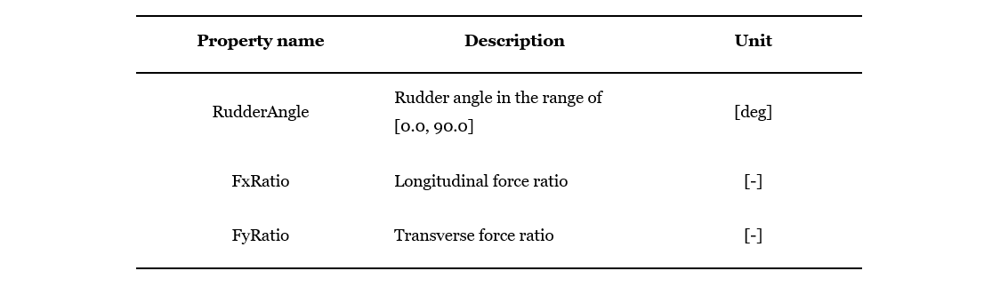

The plots of rudder performance will be shown in the Plot view.

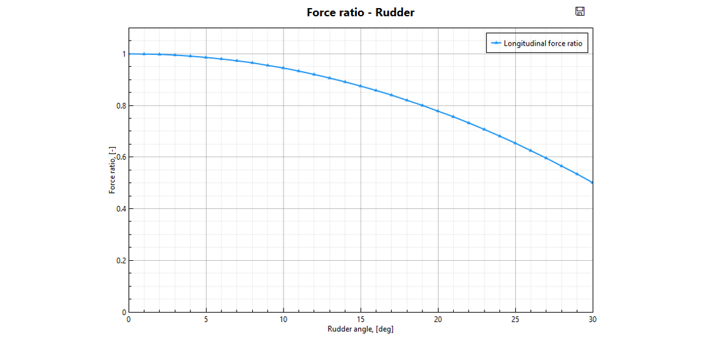

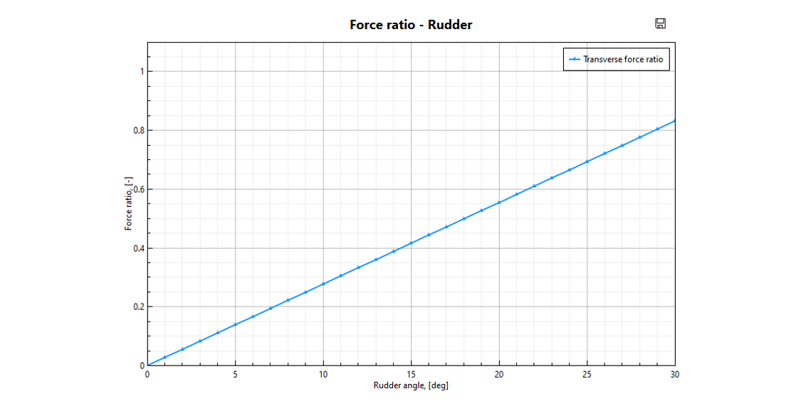

#### 3.6.2 Failure modes

Failure modes are defined in groups for batch calculation of all combinations with the environmental loads. When a thruster is set as failed, it will be out of work and marked as grey in the plot of thruster position.

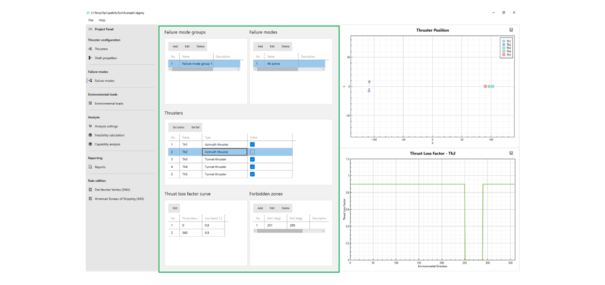

For an azimuth thruster, the thrust loss factor curve and forbidden zones can be defined for each failure mode. 

The thrust loss factor curve is defined by a number of points and linear interpolation will be applied for the thrust directions in between. The estimation of thrust loss factor can refer to DNVGL-ST-0111 2018 Assessment of station keeping capability of dynamic positioning vessels. 

Forbidden zones are defined to avoid an azimuth thruster from flushing at another thruster or the skeg. An azimuth thruster can be restricted with multiple forbidden zones, which will be shown in the Plot view for user’s reference.

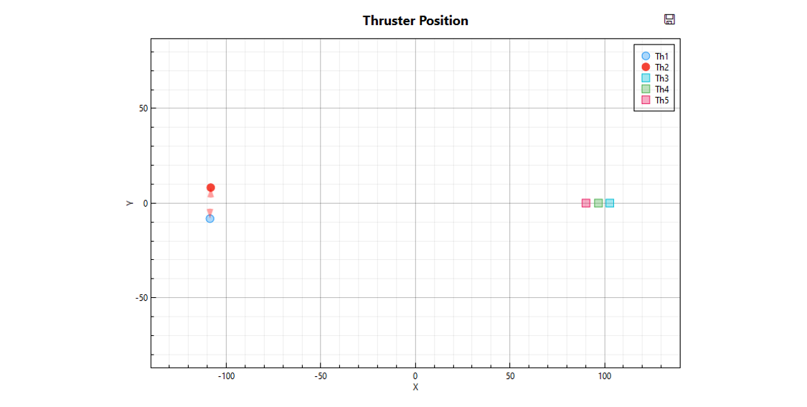

#### 3.6.3 Environmental loads

Environmental loads are defined in groups for batch calculation of all combinations with the failure modes. Also, a group of environmental loads with ascending wind speeds and DP capability numbers is essential for the capability analysis which is to find the maximum wind speed/DP capability number the vessel can keep its position with the DP system. 

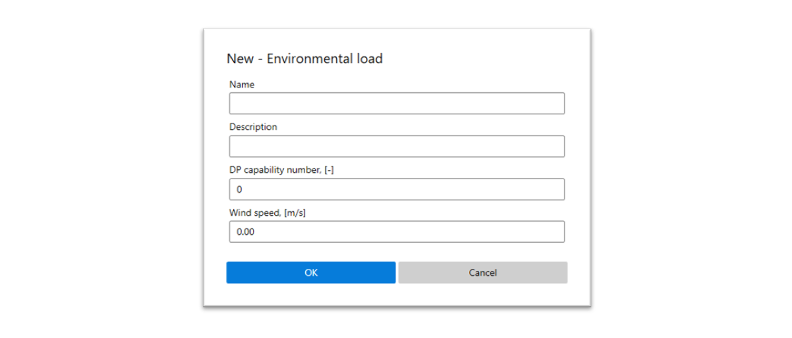

For the feasibility calculation which is to find the optimal thrust allocation among the thrusters to resist environmental loads, wind speed and DP capability number are not relevant.

Environmental load is a collection of external loads with respect to each environmental direction. The data can be specified in the table format with 4 columns, which are Direction, F_x, F_y and M_x. 

Once the external loads are specified, a rose plot of the resultant and a plot of components will be show in the Plot view.

#### 3.6.4 Analysis

Two types of analysis are supported in the program, including feasibility calculation and capability analysis. While feasibility calculation is to find the optimal thrust allocation among the thrusters to keep the vessel’s position with a certain environmental load, capability analysis explores the maximum weather conditions in which a DP vessel can maintain its position and heading.

##### 3.6.4.1 Analysis settings

Analysis settings include options related to feasibility calculation and capability analysis, as well as the rose plot settings of the results.

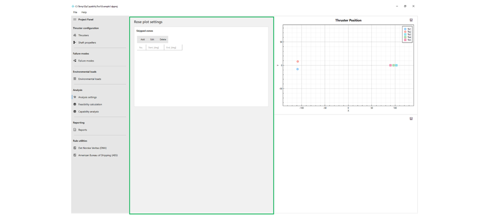

For rose plots of the results of feasibility calculation and capability analysis, the curve is drawn connecting the points ordered by direction one by one. In some cases, only a range of directions around a certain direction is of interest. Skipped zones can be added to create proper rose plots for such cases.

Below shows a normal rose plot covering the directions from 0 deg to 360 deg. 

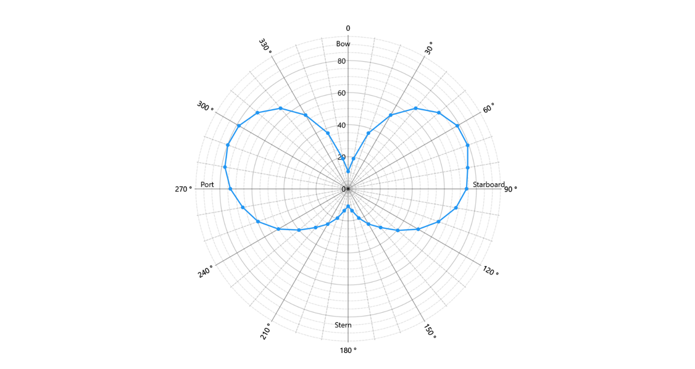

If the results from 30 deg to 330 deg are of no interest, a skipped zone can be added to adjust the rose plot.

The adjusted rose plot is shown as below.

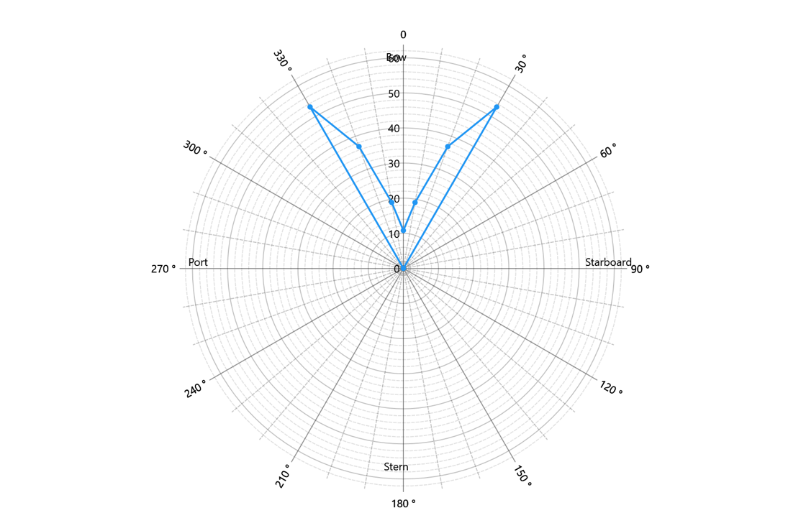

##### 3.6.4.2 Feasibility calculation

Feasibility calculation solves the thrust allocation among thrusters by minimizing the total power consumption of the DP system in the meanwhile balancing the environmental loads. 

The power required for each thruster is calculated using the following relationship

where P_(max,i) is the maximum power of thruster i,T_(nominal,i) is the nominal thrust force and T_(max,i) is the maximum nominal thrust force.

A calculation group of feasibility calculation is defined with a failure mode group and an environmental load group. All the combinations of failure modes and environmental loads will be listed once the calculation group is created.

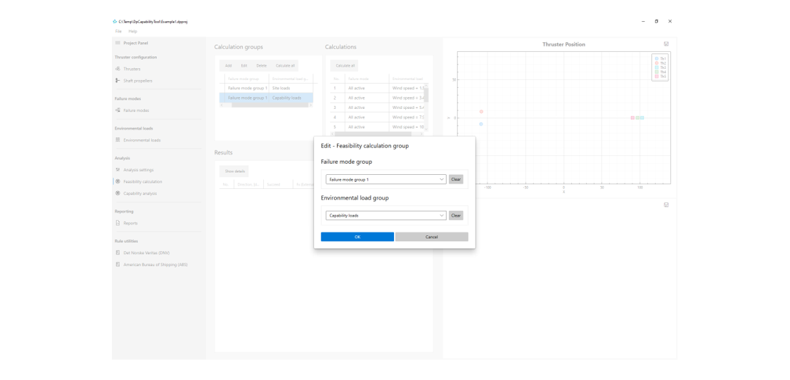

For a calculation group, all the calculations are listed in the Calculations. A calculation is the combination of a failure mode and an environmental load. Click Calculate all to calculate all the calculations, or the user can select one specific calculation in the list and calculate it alone by the context menu command.

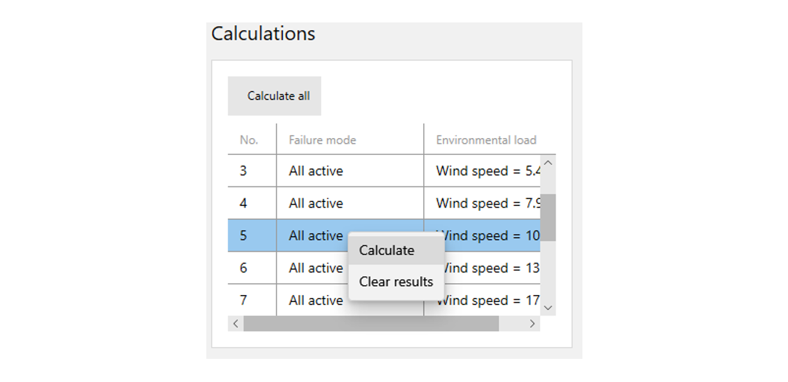

Task execution dialog pops up with relevant information, such as the total number of calculation points. A calculation point refers to the thrust allocation problem for a failure mode and environmental direction. 

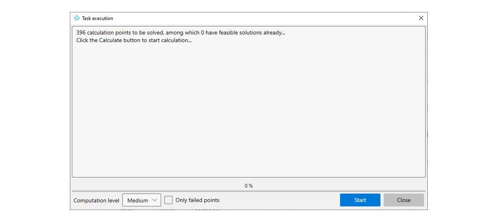

There are also options to control the computation level and filter out the calculation points with feasible solution. When the Start button is clicked, the calculation starts and the progress bar keeps updating the percentage of completion. The user can stop the calculation at any time and re-start for better solutions even if there is one already. 

When the Task execution dialog is closed, Results will be updated with the latest results. Click the Show details button to show the details of a calculation point. 

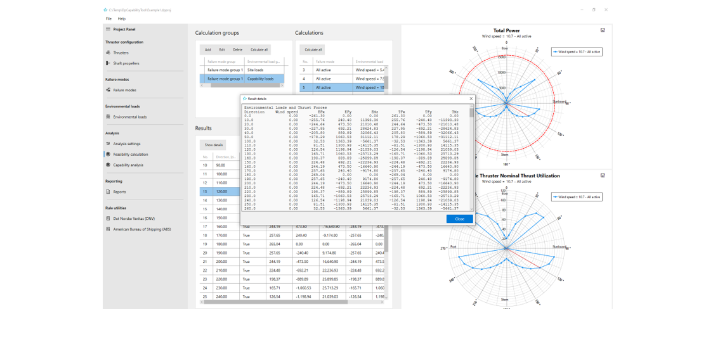

Plot view will update with the rose plots, when the selection in Calculations and Results is changed.

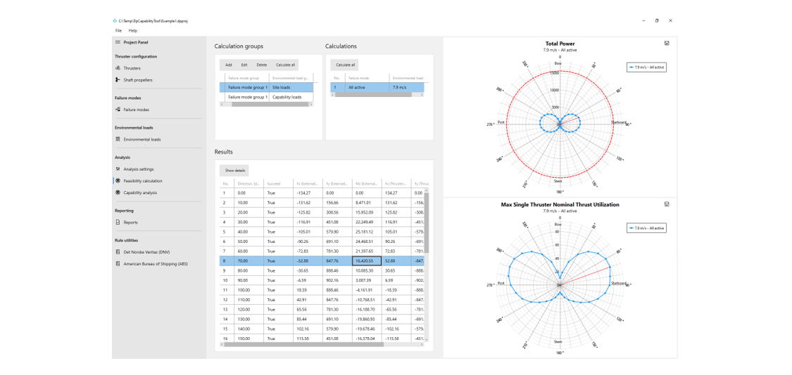

##### 3.6.4.3 Capability analysis

A calculation group in Capability analysis is similar to that in Feasibility calculation, except that it requires the wind speed and DP capability number of environmental loads are specified correctly.

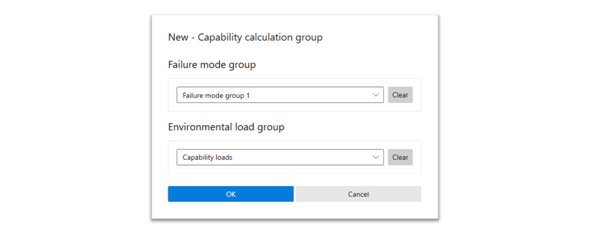

A calculation in the Calculations list is corresponding to a failure mode and an environmental load group. The rose plots maximum wind speed and DP capability number will be shown in the Plot view, if the solution of a calculation is available. 

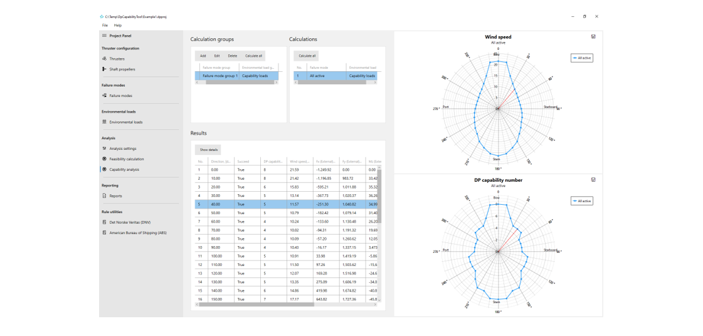

#### 3.6.5 Reporting

Convenient reporting is an important feature of the program. User can select the preferred model data and results to include in the report. A well-structured report file is created and saved to the Reports folder of the project by clicking the Create report button. The report will be opened in Word if installed automatically.

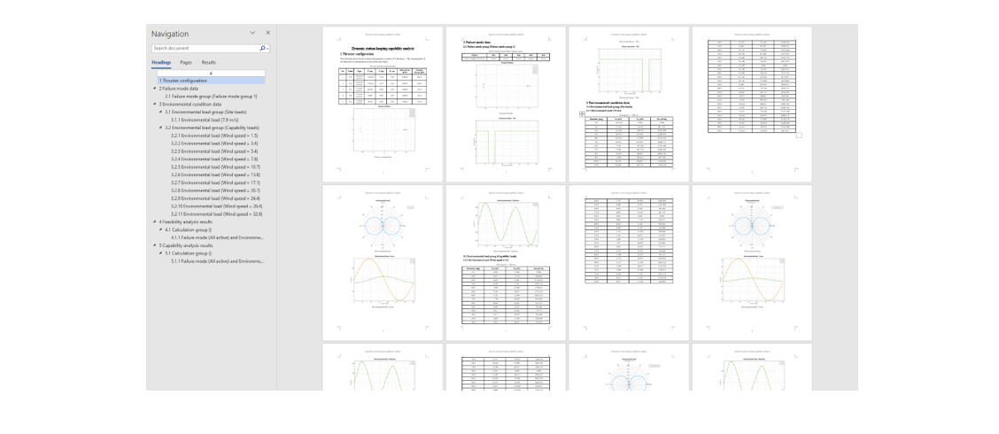

#### 3.6.6 Rule utilities

The program also includes several utilities to help calculate environmental loads, failure mode related data and rudder performance data by rules of the classification societies, such as DNV and ABS.

##### 3.6.6.1 Det Norske Veritas (DNV)

 The rule utilities of DNV are based on DNVGL-ST-0111 2018 Assessment of station keeping capability of dynamic positioning vessels. Environmental loads, including wind, current and wave, are calculated with the formulas in 3.4 Environmental loads.

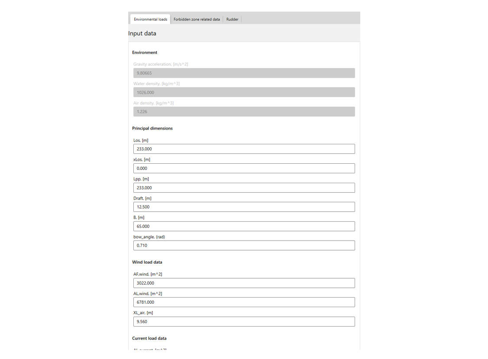

 Forbidden zone related data, such as thrust loss factors and forbidden zones, are also supported, except for the thrust loss caused by thruster ventilation.

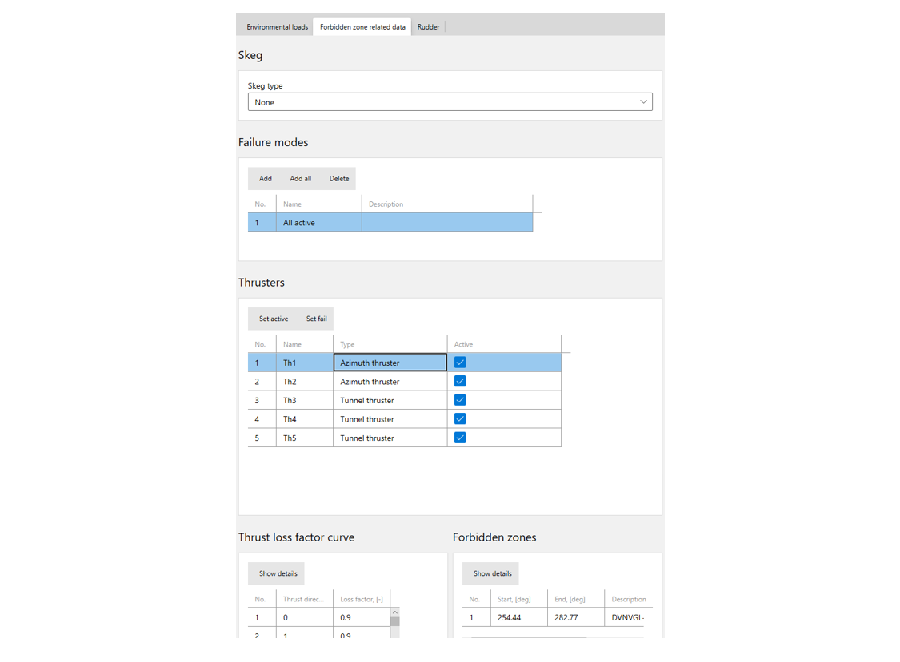

Rudder performance estimation is also available.

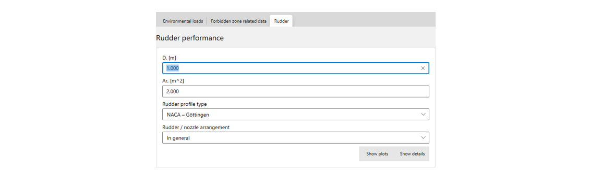

##### 3.6.6.2 American Bureau of Shipping (ABS)

Rudder performance curves from ABS Guide for Dynamic Positioning Systems (November 2013) are available.

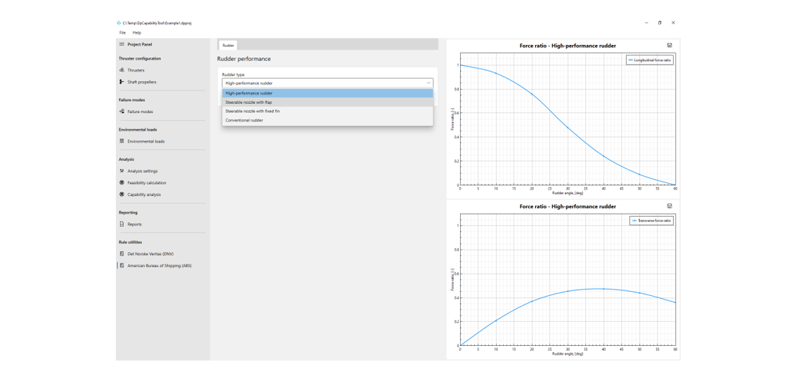
