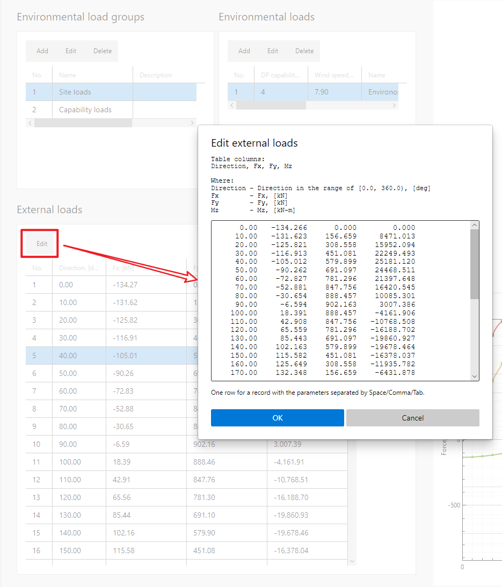
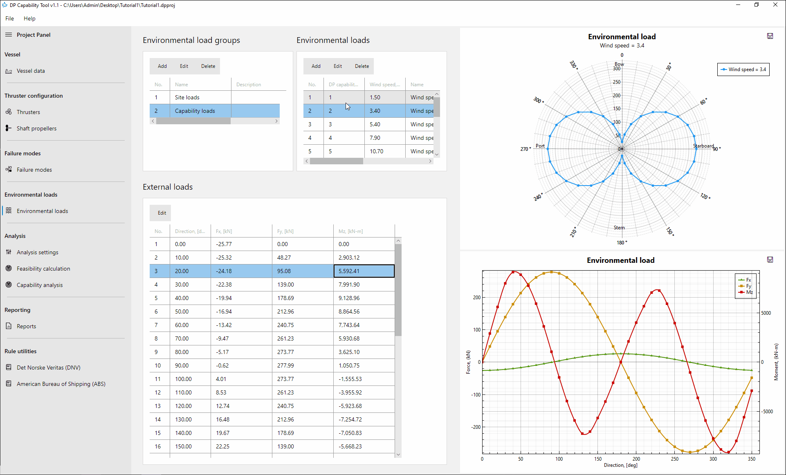

# DP capability analysis for an offshore wind turbine installation vessel

## 1. Introduction

This tutorial demonstrates how to use the **DP Capability Tool** to perform **feasibility calculation** and **capability analyses** for an offshore wind turbine installation vessel equipped with:

- **2 azimuth thrusters at the bow**
- **3 tunnel thrusters at the stern**

The complete tutorial model is provided within the software and is accessible from the Help menu.

---

## 2. Vessel data (Optional)

In a standard DP capability analysis, the first step is to input **vessel data**, which defines the vessel reference frame and serves as a container for thruster positions.

This step is optional but recommended for clarity and future model extension.

> **Note:** The vessel outline is used for visualization only and does **not** affect DP calculation results.

### Vessel outline coordinates 

| X (m) | Y (m) |
|------:|------:|
| 120.0 | 0.0 |
| 90.0 | 25.0 |
| -120.0 | 25.0 |
| -120.0 | -25.0 |
| 90.0 | -25.0 |

These outline points are linked together into a closed frame, helping users visually check and confirm the thruster locations relative to the vessel's hull.

---

## 3. Thruster configuration

This vessel configuration includes:

- **Azimuth thrusters (bow)**  
  Capable of generating thrust in any direction from **0° to 360°**

- **Tunnel thrusters (stern)**  
  Capable of generating thrust to either **port** or **starboard**

There are **no shaft propellers** in this tutorial case.

---

### 3.1 Thrusters

For each azimuth or tunnel thruster, the following parameters must be defined:

- Thruster name
- X coordinate (m)
- Y coordinate (m)
- Propeller diameter (m)
- Maximum power (kW)
- Maximum nominal thrust (kN)
- Default thrust loss factor

Each thruster is positioned relative to the vessel reference coordinate system. When a thrust loss factor curve is not supplied, the default thrust loss factor is applied to calculate the thrust force. It is especially applicable to azimuth thrusters.

#### Azimuth thrusters

| Name | X (m) | Y (m) | Diameter (m) | Max power (kW) | Nominal thrust (kN) | Default thrust loss factor |
|------|------:|------:|-------------:|--------------:|--------------------:|---------------------------:|
| Th1  | -108.6 | -8.2 | 0 | 4,500.00 | 694.428 | 0.9 |
| Th2  | -108.6 | 8.2  | 0 | 4,500.00 | 694.428 | 0.9 |

#### Tunnel thrusters

| Name | X (m) | Y (m) | Diameter (m) | Max power (kW) | Nominal thrust (kN) | Default thrust loss factor |
|------|------:|------:|-------------:|--------------:|--------------------:|---------------------------:|
| Th3  | 102.8 | 0 | 0 | 2,200.00 | 252.36 | 0.9 |
| Th4  | 96.8  | 0 | 0 | 2,200.00 | 252.36 | 0.9 |
| Th5  | 90.2  | 0 | 0 | 2,200.00 | 252.36 | 0.9 |

The thruster position plot displays each azimuth thruster, tunnel thruster, and shaft propeller using a distinct shape and color for each type. When a thruster is selected in the list, it will be highlighted in the plot accordingly.

---

## 5. Failure mode definition

Failure modes are organized into **failure mode groups**, each representing a specific operational scenario, such as:

- Intact condition (all thrusters active)
- Single thruster failure
- Multiple thruster failures

The user must:

1. Create a failure mode group with a meaningful name
2. Define one or more failure modes within the group
3. Specify which thrusters are **active** or **failed** in each mode
4. Specify azimuth thruster thrust loss factor curves and restricted azimuth sectors

---

### 5.1 Azimuth thruster restrictions

For azimuth thrusters, additional constraints can be applied:

- **Thrust factor curve** over the full **0–360°** range  
- **Multiple forbidden azimuth zones**, where thrust is restricted or not allowed  

These settings allow realistic modeling of mechanical, structural, or operational limitations. 

DNV-ST-0111 and the ABS Guide for Dynamic Positioning Systems provide detailed guidance on how to account for thrust loss factor curves and forbidden zones.

In this tutorial, the thrust loss factor for **Th1** is set to 0.9 over the full 360° azimuth range, with a forbidden zone defined between 71° and 109°.

The thrust loss factor for **Th2** is identical to that of **Th1**, while its forbidden zone is defined on the opposite side, ranging from 251° to 289°.

The thrust loss factor curve is presented in the right-side plot, and the forbidden zones are marked on the azimuth thrusters in the thruster position view.

---

## 6. Environmental load definition

Environmental loads are defined for both feasibility calculations and capability analysis to assess the resistance capacity of the dynamic positioning system.

Environmental loads are organized into groups, each representing a specific wind speed or wind speed series, which is particularly suitable for capability analysis to evaluate the maximum wind speed or DP capability number that the dynamic positioning system can withstand.

External loads generally arise from wind, current, and waves, and are combined into a resultant load for each direction. These loads should be determined through numerical simulations or physical model tests. Classification guidelines, such as DNV-ST-0111, also provide empirical formulas for simplified evaluation of environmental loads.

Environmental loads can be entered in tabular form, with the first column representing direction and the subsequent three columns defining the Fx, Fy, and Mz components.
 

In this tutorial, two environmental load groups are used:

### 6.1 Site loads

The **Site loads** group contains only one environmental load table, which is used for feasibility calculation and corresponds to a single site-specific environmental condition.

The external load data are provided in the following table.

| Direction (deg) | Fx (kN) | Fy (kN) | Mz (kN-m) |
|----------------:|-------------:|-------------:|-------------:|
| 0.00  | -134.266 | 0.000 | 0.000 |
| 10.00 | -131.623 | 156.659 | 8471.013 |
| 20.00 | -125.821 | 308.558 | 15952.094 |
| 30.00 | -116.913 | 451.081 | 22249.493 |
| 40.00 | -105.012 | 579.899 | 25181.120 |
| 50.00 | -90.262 | 691.097 | 24468.511 |
| 60.00 | -72.827 | 781.296 | 21397.648 |
| 70.00 | -52.881 | 847.756 | 16420.545 |
| 80.00 | -30.654 | 888.457 | 10085.301 |
| 90.00 | -6.594 | 902.163 | 3007.386 |
| 100.00 | 18.391 | 888.457 | -4161.906 |
| 110.00 | 42.908 | 847.756 | -10768.508 |
| 120.00 | 65.559 | 781.296 | -16188.702 |
| 130.00 | 85.443 | 691.097 | -19860.927 |
| 140.00 | 102.163 | 579.899 | -19678.464 |
| 150.00 | 115.582 | 451.081 | -16378.037 |
| 160.00 | 125.649 | 308.558 | -11935.782 |
| 170.00 | 132.348 | 156.659 | -6431.878 |
| 180.00 | 135.698 | 0.000 | 0.000 |
| 190.00 | 132.348 | -156.659 | 6431.878 |
| 200.00 | 125.649 | -308.558 | 11935.782 |
| 210.00 | 115.582 | -451.081 | 16378.037 |
| 220.00 | 102.163 | -579.899 | 19678.464 |
| 230.00 | 85.443 | -691.097 | 19860.927 |
| 240.00 | 65.559 | -781.296 | 16188.702 |
| 250.00 | 42.908 | -847.756 | 10768.508 |
| 260.00 | 18.391 | -888.457 | 4161.906 |
| 270.00 | -6.594 | -902.163 | -3007.386 |
| 280.00 | -30.654 | -888.457 | -10085.301 |
| 290.00 | -52.881 | -847.756 | -16420.545 |
| 300.00 | -72.827 | -781.296 | -21397.648 |
| 310.00 | -90.262 | -691.097 | -24468.511 |
| 320.00 | -105.012 | -579.899 | -25181.120 |
| 330.00 | -116.913 | -451.081 | -22249.493 |
| 340.00 | -125.821 | -308.558 | -15952.094 |
| 350.00 | -131.623 | -156.659 | -8471.013 |

### 6.2  Capability loads

The **Capability loads** group consists of 11 environmental load tables corresponding to different Beaufort scale levels, each associated with a specific wind speed and DP capability number. The wind speed, significant wave height, peak wave period, and current speed for each Beaufort level are taken from DNV-ST-0111 to evaluate wind-, wave-, and current-induced loads.

This group is used to determine the maximum wind speed or DP capability number that the DP system can withstand.

When you select an environmental load table, the wind rose and component load curves appear in the plot views on the right.

The external load data are provided in the following tables.

#### 6.2.1  DP capability number 1

| Direction (deg) | Fx (kN) | Fy (kN) | Mz (kN-m) |
|----------------:|-----------:|-----------:|-----------:|
| 0.00  | -4.956 | 0.000 | 0.000 |
| 10.00 | -4.877 | 11.102 | 690.490 |
| 20.00 | -4.655 | 21.867 | 1336.938 |
| 30.00 | -4.296 | 31.967 | 1920.758 |
| 40.00 | -3.809 | 41.096 | 2198.655 |
| 50.00 | -3.209 | 48.977 | 2135.218 |
| 60.00 | -2.512 | 55.369 | 1865.556 |
| 70.00 | -1.736 | 60.079 | 1429.262 |
| 80.00 | -0.904 | 62.963 | 874.330 |
| 90.00 | -0.039 | 63.935 | 254.648 |
| 100.00 | 0.831 | 62.963 | -372.772 |
| 110.00 | 1.677 | 60.079 | -950.680 |
| 120.00 | 2.469 | 55.369 | -1424.493 |
| 130.00 | 3.181 | 48.977 | -1745.075 |
| 140.00 | 3.793 | 41.096 | -1689.460 |
| 150.00 | 4.288 | 31.967 | -1347.880 |
| 160.00 | 4.654 | 21.867 | -945.066 |
| 170.00 | 4.882 | 11.102 | -491.532 |
| 180.00 | 4.965 | 0.000 | 0.000 |
| 190.00 | 4.882 | -11.102 | 491.532 |
| 200.00 | 4.654 | -21.867 | 945.066 |
| 210.00 | 4.288 | -31.967 | 1347.880 |
| 220.00 | 3.793 | -41.096 | 1689.460 |
| 230.00 | 3.181 | -48.977 | 1745.075 |
| 240.00 | 2.469 | -55.369 | 1424.493 |
| 250.00 | 1.677 | -60.079 | 950.680 |
| 260.00 | 0.831 | -62.963 | 372.772 |
| 270.00 | -0.039 | -63.935 | -254.648 |
| 280.00 | -0.904 | -62.963 | -874.330 |
| 290.00 | -1.736 | -60.079 | -1429.262 |
| 300.00 | -2.512 | -55.369 | -1865.556 |
| 310.00 | -3.209 | -48.977 | -2135.218 |
| 320.00 | -3.809 | -41.096 | -2198.655 |
| 330.00 | -4.296 | -31.967 | -1920.758 |
| 340.00 | -4.655 | -21.867 | -1336.938 |
| 350.00 | -4.877 | -11.102 | -690.490 |

#### 6.2.2  DP capability number 2

| Direction (deg) | Fx (kN) | Fy (kN) | Mz (kN-m) |
|----------------:|-------:|--------:|---------:|
| 0.00   | -25.769 | 0.000   | 0.000    |
| 10.00  | -25.320 | 48.273  | 2903.122 |
| 20.00  | -24.182 | 95.080  | 5592.408 |
| 30.00  | -22.377 | 138.997 | 7991.899 |
| 40.00  | -19.944 | 178.692 | 9128.956 |
| 50.00  | -16.939 | 212.956 | 8864.557 |
| 60.00  | -13.424 | 240.750 | 7743.636 |
| 70.00  | -9.472  | 261.230 | 5930.685 |
| 80.00  | -5.170  | 273.771 | 3625.103 |
| 90.00  | -0.624  | 277.995 | 1050.749 |
| 100.00 | 4.009   | 273.771 | -1555.531 |
| 110.00 | 8.528   | 261.230 | -3955.922 |
| 120.00 | 12.735  | 240.750 | -5923.684 |
| 130.00 | 16.482  | 212.956 | -7254.716 |
| 140.00 | 19.675  | 178.692 | -7050.835 |
| 150.00 | 22.251  | 138.997 | -5668.230 |
| 160.00 | 24.166  | 95.080  | -4002.924 |
| 170.00 | 25.389  | 48.273  | -2096.120 |
| 180.00 | 25.905  | 0.000   | 0.000    |
| 190.00 | 25.389  | -48.273 | 2096.120 |
| 200.00 | 24.166  | -95.080 | 4002.924 |
| 210.00 | 22.251  | -138.997| 5668.230 |
| 220.00 | 19.675  | -178.692| 7050.835 |
| 230.00 | 16.482  | -212.956| 7254.716 |
| 240.00 | 12.735  | -240.750| 5923.684 |
| 250.00 | 8.528   | -261.230| 3955.922 |
| 260.00 | 4.009   | -273.771| 1555.531 |
| 270.00 | -0.624  | -277.995| -1050.749 |
| 280.00 | -5.170  | -273.771| -3625.103 |
| 290.00 | -9.472  | -261.230| -5930.685 |
| 300.00 | -13.424 | -240.750| -7743.636 |
| 310.00 | -16.939 | -212.956| -8864.557 |
| 320.00 | -19.944 | -178.692| -9128.956 |
| 330.00 | -22.377 | -138.997| -7991.899 |
| 340.00 | -24.182 | -95.080 | -5592.408 |
| 350.00 | -25.320 | -48.273 | -2903.122 |

#### 6.2.3  DP capability number 3

| Direction (deg) | Fx (kN) | Fy (kN) | Mz (kN-m) |
|---------------:|---------:|---------:|----------:|
| 0.00   | -68.192  | 0.000   | 0.000    |
| 10.00  | -66.928  | 115.800 | 6729.700 |
| 20.00  | -63.948  | 228.082 | 12922.488|
| 30.00  | -59.297  | 333.434 | 18405.429|
| 40.00  | -53.056  | 428.655 | 20991.250|
| 50.00  | -45.332  | 510.851 | 20371.374|
| 60.00  | -36.252  | 577.525 | 17778.888|
| 70.00  | -25.959  | 626.651 | 13593.258|
| 80.00  | -14.621  | 656.737 | 8274.349 |
| 90.00  | -2.497   | 666.868 | 2338.346 |
| 100.00 | 9.977    | 656.737 | -3668.707|
| 110.00 | 22.182   | 626.651 | -9198.605|
| 120.00 | 33.500   | 577.525 | -13728.754|
| 130.00 | 43.507   | 510.851 | -16788.820|
| 140.00 | 51.977   | 428.655 | -16348.696|
| 150.00 | 58.793   | 333.434 | -13203.013|
| 160.00 | 63.883   | 228.082 | -9363.826 |
| 170.00 | 67.203   | 115.800 | -4922.920 |
| 180.00 | 68.735   | 0.000   | 0.000    |
| 190.00 | 67.203   | -115.800| 4922.920 |
| 200.00 | 63.883   | -228.082| 9363.826 |
| 210.00 | 58.793   | -333.434| 13203.013|
| 220.00 | 51.977   | -428.655| 16348.696|
| 230.00 | 43.507   | -510.851| 16788.820|
| 240.00 | 33.500   | -577.525| 13728.754|
| 250.00 | 22.182   | -626.651| 9198.605 |
| 260.00 | 9.977    | -656.737| 3668.707 |
| 270.00 | -2.497   | -666.868| -2338.346|
| 280.00 | -14.621  | -656.737| -8274.349|
| 290.00 | -25.959  | -626.651| -13593.258|
| 300.00 | -36.252  | -577.525| -17778.888|
| 310.00 | -45.332  | -510.851| -20371.374|
| 320.00 | -53.056  | -428.655| -20991.250|
| 330.00 | -59.297  | -333.434| -18405.429|
| 340.00 | -63.948  | -228.082| -12922.488|
| 350.00 | -66.928  | -115.800| -6729.700 |

#### 6.2.4  DP capability number 4

| Direction (deg) | Fx (kN) | Fy (kN) | Mz (kN-m) |
|----------------:|---------:|---------:|----------:|
| 0.00   | -134.266 | 0.000    | 0.000    |
| 10.00  | -131.623 | 156.659  | 8471.013 |
| 20.00  | -125.821 | 308.558  | 15952.094 |
| 30.00  | -116.913 | 451.081  | 22249.493 |
| 40.00  | -105.012 | 579.899  | 25181.120 |
| 50.00  | -90.262  | 691.097  | 24468.511 |
| 60.00  | -72.827  | 781.296  | 21397.648 |
| 70.00  | -52.881  | 847.756  | 16420.545 |
| 80.00  | -30.654  | 888.457  | 10085.301 |
| 90.00  | -6.594   | 902.163  | 3007.386 |
| 100.00 | 18.391   | 888.457  | -4161.906 |
| 110.00 | 42.908   | 847.756  | -10768.508 |
| 120.00 | 65.559   | 781.296  | -16188.702 |
| 130.00 | 85.443   | 691.097  | -19860.927 |
| 140.00 | 102.163  | 579.899  | -19678.464 |
| 150.00 | 115.582  | 451.081  | -16378.037 |
| 160.00 | 125.649  | 308.558  | -11935.782 |
| 170.00 | 132.348  | 156.659  | -6431.878 |
| 180.00 | 135.698  | 0.000    | 0.000    |
| 190.00 | 132.348  | -156.659 | 6431.878 |
| 200.00 | 125.649  | -308.558 | 11935.782 |
| 210.00 | 115.582  | -451.081 | 16378.037 |
| 220.00 | 102.163  | -579.899 | 19678.464 |
| 230.00 | 85.443   | -691.097 | 19860.927 |
| 240.00 | 65.559   | -781.296 | 16188.702 |
| 250.00 | 42.908   | -847.756 | 10768.508 |
| 260.00 | 18.391   | -888.457 | 4161.906 |
| 270.00 | -6.594   | -902.163 | -3007.386 |
| 280.00 | -30.654  | -888.457 | -10085.301 |
| 290.00 | -52.881  | -847.756 | -16420.545 |
| 300.00 | -72.827  | -781.296 | -21397.648 |
| 310.00 | -90.262  | -691.097 | -24468.511 |
| 320.00 | -105.012 | -579.899 | -25181.120 |
| 330.00 | -116.913 | -451.081 | -22249.493 |
| 340.00 | -125.821 | -308.558 | -15952.094 |
| 350.00 | -131.623 | -156.659 | -8471.013 |

#### 6.2.5  DP capability number  5

| Direction (deg) | Fx (kN) | Fy (kN) | Mz (kN-m) |
|----------------:|---------:|---------:|----------:|
| 0.00   | -261.302 | 0.000   | 0.000    |
| 10.00  | -255.760 | 240.402 | 11393.297 |
| 20.00  | -244.636 | 473.499 | 21010.477 |
| 30.00  | -227.954 | 692.210 | 28624.834 |
| 40.00  | -205.801 | 889.888 | 32066.431 |
| 50.00  | -178.289 | 1060.527 | 31112.110 |
| 60.00  | -145.510 | 1198.943 | 27142.482 |
| 70.00  | -107.531 | 1300.929 | 20737.985 |
| 80.00  | -64.526  | 1363.387 | 12601.961 |
| 90.00  | -17.206  | 1384.420 | 3523.830  |
| 100.00 | 32.527   | 1363.387 | -5661.370 |
| 110.00 | 81.507   | 1300.929 | -14115.350 |
| 120.00 | 126.544  | 1198.943 | -21039.029 |
| 130.00 | 165.714  | 1060.527 | -25713.288 |
| 140.00 | 198.368  | 889.888  | -25899.848 |
| 150.00 | 224.479  | 692.210  | -22236.934 |
| 160.00 | 244.187  | 473.499  | -16640.896 |
| 170.00 | 257.652  | 240.402  | -9174.803  |
| 180.00 | 265.039  | 0.000    | 0.000      |
| 190.00 | 257.652  | -240.402 | 9174.803   |
| 200.00 | 244.187  | -473.499 | 16640.896  |
| 210.00 | 224.479  | -692.210 | 22236.934  |
| 220.00 | 198.368  | -889.888 | 25899.848  |
| 230.00 | 165.714  | -1060.527 | 25713.288 |
| 240.00 | 126.544  | -1198.943 | 21039.029 |
| 250.00 | 81.507   | -1300.929 | 14115.350 |
| 260.00 | 32.527   | -1363.387 | 5661.370  |
| 270.00 | -17.206  | -1384.420 | -3523.830 |
| 280.00 | -64.526  | -1363.387 | -12601.961 |
| 290.00 | -107.531 | -1300.929 | -20737.985 |
| 300.00 | -145.510 | -1198.943 | -27142.482 |
| 310.00 | -178.289 | -1060.527 | -31112.110 |
| 320.00 | -205.801 | -889.888  | -32066.431 |
| 330.00 | -227.954 | -692.210  | -28624.834 |
| 340.00 | -244.636 | -473.499  | -21010.477 |
| 350.00 | -255.760 | -240.402  | -11393.297 |

#### 6.2.6  DP capability number 6

| Direction (deg) | Fx (kN) | Fy (kN) | Mz (kN-m) |
|----------------:|---------:|---------:|-----------:|
| 0.00   | -464.248 | 0.000     | 0.000      |
| 10.00  | -453.921 | 385.173   | 15878.418  |
| 20.00  | -434.361 | 758.643   | 28746.335  |
| 30.00  | -405.508 | 1109.062  | 38328.577  |
| 40.00  | -367.365 | 1425.782  | 42477.558  |
| 50.00  | -319.922 | 1699.181  | 41060.107  |
| 60.00  | -263.070 | 1920.951  | 35608.347  |
| 70.00  | -196.603 | 2084.354  | 26906.963  |
| 80.00  | -120.502 | 2184.425  | 15905.243  |
| 90.00  | -35.834  | 2218.124  | 3667.421   |
| 100.00 | 53.858   | 2184.425  | -8681.833  |
| 110.00 | 142.406  | 2084.354  | -20014.466 |
| 120.00 | 223.571  | 1920.951  | -29256.187 |
| 130.00 | 293.732  | 1699.181  | -35441.292 |
| 140.00 | 351.884  | 1425.782  | -36126.378 |
| 150.00 | 398.269  | 1109.062  | -31797.086 |
| 160.00 | 433.426  | 758.643   | -24278.532 |
| 170.00 | 457.861  | 385.173   | -13610.055 |
| 180.00 | 472.032  | 0.000     | 0.000      |
| 190.00 | 457.861  | -385.173  | 13610.055  |
| 200.00 | 433.426  | -758.643  | 24278.532  |
| 210.00 | 398.269  | -1109.062 | 31797.086  |
| 220.00 | 351.884  | -1425.782 | 36126.378  |
| 230.00 | 293.732  | -1699.181 | 35441.292  |
| 240.00 | 223.571  | -1920.951 | 29256.187  |
| 250.00 | 142.406  | -2084.354 | 20014.466  |
| 260.00 | 53.858   | -2184.425 | 8681.833   |
| 270.00 | -35.834  | -2218.124 | -3667.421  |
| 280.00 | -120.502 | -2184.425 | -15905.243 |
| 290.00 | -196.603 | -2084.354 | -26906.963 |
| 300.00 | -263.070 | -1920.951 | -35608.347 |
| 310.00 | -319.922 | -1699.181 | -41060.107 |
| 320.00 | -367.365 | -1425.782 | -42477.558 |
| 330.00 | -405.508 | -1109.062 | -38328.577 |
| 340.00 | -434.361 | -758.643  | -28746.335 |
| 350.00 | -453.921 | -385.173  | -15878.418 |

#### 6.2.7  DP capability number 7

| Direction (deg) | Fx (kN) | Fy (kN) | Mz (kN-m) |
|----------------:|---------:|---------:|----------:|
| 0.00   | -744.060 | 0.000    | 0.000      |
| 10.00  | -727.077 | 594.236  | 22090.086  |
| 20.00  | -695.910 | 1170.416 | 39437.695  |
| 30.00  | -650.370 | 1711.034 | 51702.237  |
| 40.00  | -590.328 | 2199.663 | 56770.066  |
| 50.00  | -515.578 | 2621.457 | 54636.767  |
| 60.00  | -425.703 | 2963.598 | 47049.363  |
| 70.00  | -320.081 | 3215.693 | 35081.182  |
| 80.00  | -198.384 | 3370.080 | 20028.335  |
| 90.00  | -62.152  | 3422.069 | 3341.994   |
| 100.00 | 82.796   | 3370.080 | -13445.891 |
| 110.00 | 226.080  | 3215.693 | -28800.287 |
| 120.00 | 357.196  | 2963.598 | -41260.858 |
| 130.00 | 470.154  | 2621.457 | -49516.535 |
| 140.00 | 563.477  | 2199.663 | -50837.247 |
| 150.00 | 637.817  | 1711.034 | -45496.173 |
| 160.00 | 694.288  | 1170.416 | -35192.497 |
| 170.00 | 733.910  | 594.236  | -19934.743 |
| 180.00 | 757.560  | 0.000    | 0.000      |
| 190.00 | 733.910  | -594.236 | 19934.743  |
| 200.00 | 694.288  | -1170.416| 35192.497  |
| 210.00 | 637.817  | -1711.034| 45496.173  |
| 220.00 | 563.477  | -2199.663| 50837.247  |
| 230.00 | 470.154  | -2621.457| 49516.535  |
| 240.00 | 357.196  | -2963.598| 41260.858  |
| 250.00 | 226.080  | -3215.693| 28800.287  |
| 260.00 | 82.796   | -3370.080| 13445.891  |
| 270.00 | -62.152  | -3422.069| -3341.994  |
| 280.00 | -198.384 | -3370.080| -20028.335 |
| 290.00 | -320.081 | -3215.693| -35081.182 |
| 300.00 | -425.703 | -2963.598| -47049.363 |
| 310.00 | -515.578 | -2621.457| -54636.767 |
| 320.00 | -590.328 | -2199.663| -56770.066 |
| 330.00 | -650.370 | -1711.034| -51702.237 |
| 340.00 | -695.910 | -1170.416| -39437.695 |
| 350.00 | -727.077 | -594.236 | -22090.086 |

#### 6.2.8  DP capability number 8

| Direction (deg) | Fx (kN) | Fy (kN) | Mz (kN-m) |
|----------------:|----------:|----------:|-----------:|
| 0.00   | -1124.634 | 0.000    | 0.000     |
| 10.00  | -1098.545 | 901.735  | 31128.605 |
| 20.00  | -1051.614 | 1776.071 | 54908.885 |
| 30.00  | -983.469  | 2596.442 | 70911.595 |
| 40.00  | -893.780  | 3337.922 | 77083.888 |
| 50.00  | -782.053  | 3977.980 | 73624.465 |
| 60.00  | -647.422  | 4497.170 | 62612.411 |
| 70.00  | -488.661  | 4879.715 | 45563.117 |
| 80.00  | -304.983  | 5113.993 | 24301.045 |
| 90.00  | -98.549   | 5192.885 | 864.600   |
| 100.00 | 121.704   | 5113.993 | -22598.116|
| 110.00 | 339.611   | 4879.715 | -43938.201|
| 120.00 | 538.796   | 4497.170 | -61114.881|
| 130.00 | 710.028   | 3977.980 | -72299.821|
| 140.00 | 851.205   | 3337.922 | -74335.946|
| 150.00 | 963.563   | 2596.442 | -67182.926|
| 160.00 | 1049.042  | 1776.071 | -52358.325|
| 170.00 | 1109.379  | 901.735  | -29833.651|
| 180.00 | 1146.040  | 0.000    | 0.000     |
| 190.00 | 1109.379  | -901.735 | 29833.651 |
| 200.00 | 1049.042  | -1776.071| 52358.325 |
| 210.00 | 963.563   | -2596.442| 67182.926 |
| 220.00 | 851.205   | -3337.922| 74335.946 |
| 230.00 | 710.028   | -3977.980| 72299.821 |
| 240.00 | 538.796   | -4497.170| 61114.881 |
| 250.00 | 339.611   | -4879.715| 43938.201 |
| 260.00 | 121.704   | -5113.993| 22598.116 |
| 270.00 | -98.549   | -5192.885| -864.600  |
| 280.00 | -304.983  | -5113.993| -24301.045|
| 290.00 | -488.661  | -4879.715| -45563.117|
| 300.00 | -647.422  | -4497.170| -62612.411|
| 310.00 | -782.053  | -3977.980| -73624.465|
| 320.00 | -893.780  | -3337.922| -77083.888|
| 330.00 | -983.469  | -2596.442| -70911.595|
| 340.00 | -1051.614 | -1776.071| -54908.885|
| 350.00 | -1098.545 | -901.735 | -31128.605|

#### 6.2.9  DP capability number 9

| Direction (deg) | Fx (kN) | Fy (kN) | Mz (kN-m) |
|----------------:|---------:|---------:|-----------:|
| 0.00   | -1643.573 | 0.000     | 0.000      |
| 10.00  | -1604.671 | 1323.829  | 42947.809  |
| 20.00  | -1536.413 | 2607.435  | 75062.596  |
| 30.00  | -1438.088 | 3811.815  | 95805.061  |
| 40.00  | -1308.969 | 4900.374  | 103212.148 |
| 50.00  | -1148.000 | 5840.039  | 97762.357  |
| 60.00  | -953.477  | 6602.257  | 81986.442  |
| 70.00  | -723.084  | 7163.868  | 57997.720  |
| 80.00  | -455.140  | 7507.809  | 28332.900  |
| 90.00  | -152.494  | 7623.629  | -4179.924  |
| 100.00 | 171.536   | 7507.809  | -36565.743 |
| 110.00 | 492.446   | 7163.868  | -65853.408 |
| 120.00 | 785.390   | 6602.257  | -89226.283 |
| 130.00 | 1036.549  | 5840.039  | -104166.372|
| 140.00 | 1243.089  | 4900.374  | -106949.320|
| 150.00 | 1407.286  | 3811.815  | -97120.916 |
| 160.00 | 1532.433  | 2607.435  | -75962.693 |
| 170.00 | 1621.436  | 1323.829  | -43404.800 |
| 180.00 | 1676.696  | 0.000     | 0.000      |
| 190.00 | 1621.436  | -1323.829 | 43404.800  |
| 200.00 | 1532.433  | -2607.435 | 75962.693  |
| 210.00 | 1407.286  | -3811.815 | 97120.916  |
| 220.00 | 1243.089  | -4900.374 | 106949.320 |
| 230.00 | 1036.549  | -5840.039 | 104166.372 |
| 240.00 | 785.390   | -6602.257 | 89226.283  |
| 250.00 | 492.446   | -7163.868 | 65853.408  |
| 260.00 | 171.536   | -7507.809 | 36565.743  |
| 270.00 | -152.494  | -7623.629 | 4179.924   |
| 280.00 | -455.140  | -7507.809 | -28332.900 |
| 290.00 | -723.084  | -7163.868 | -57997.720 |
| 300.00 | -953.477  | -6602.257 | -81986.442 |
| 310.00 | -1148.000 | -5840.039 | -97762.357 |
| 320.00 | -1308.969 | -4900.374 | -103212.148|
| 330.00 | -1438.088 | -3811.815 | -95805.061 |
| 340.00 | -1536.413 | -2607.435 | -75062.596 |
| 350.00 | -1604.671 | -1323.829 | -42947.809 |

#### 6.2.10  DP capability number 10

| Direction (deg) | Fx (kN) | Fy (kN) | Mz (kN-m) |
|----------------:|---------:|---------:|-----------:|
| 0.00   | -2238.785 | 0.000      | 0.000       |
| 10.00  | -2185.605 | 1821.944  | 59230.178   |
| 20.00  | -2092.708 | 3588.528  | 102696.564  |
| 30.00  | -1959.084 | 5246.078  | 129718.166  |
| 40.00  | -1783.686 | 6744.227  | 138472.969  |
| 50.00  | -1564.988 | 8037.457  | 129848.888  |
| 60.00  | -1300.566 | 9086.473  | 107028.331  |
| 70.00  | -987.136  | 9859.401  | 72981.846   |
| 80.00  | -622.277  | 10332.756 | 31263.357   |
| 90.00  | -209.794  | 10492.155 | -14174.369  |
| 100.00 | 232.107   | 10332.756 | -59181.413  |
| 110.00 | 669.834   | 9859.401  | -99620.945  |
| 120.00 | 1069.319  | 9086.473  | -131579.058 |
| 130.00 | 1411.659  | 8037.457  | -151565.281 |
| 140.00 | 1693.050  | 6744.227  | -155058.753 |
| 150.00 | 1916.708  | 5246.078  | -141028.465 |
| 160.00 | 2087.233  | 3588.528  | -110433.264 |
| 170.00 | 2208.670  | 1821.944  | -63158.204  |
| 180.00 | 2284.355  | 0.000     | 0.000       |
| 190.00 | 2208.670  | -1821.944 | 63158.204   |
| 200.00 | 2087.233  | -3588.528 | 110433.264  |
| 210.00 | 1916.708  | -5246.078 | 141028.465  |
| 220.00 | 1693.050  | -6744.227 | 155058.753  |
| 230.00 | 1411.659  | -8037.457 | 151565.281  |
| 240.00 | 1069.319  | -9086.473 | 131579.058  |
| 250.00 | 669.834   | -9859.401 | 99620.945   |
| 260.00 | 232.107   | -10332.756| 59181.413   |
| 270.00 | -209.794  | -10492.155| 14174.369   |
| 280.00 | -622.277  | -10332.756| -31263.357  |
| 290.00 | -987.136  | -9859.401 | -72981.846  |
| 300.00 | -1300.566 | -9086.473 | -107028.331 |
| 310.00 | -1564.988 | -8037.457 | -129848.888 |
| 320.00 | -1783.686 | -6744.227 | -138472.969 |
| 330.00 | -1959.084 | -5246.078 | -129718.166 |
| 340.00 | -2092.708 | -3588.528 | -102696.564 |
| 350.00 | -2185.605 | -1821.944 | -59230.178  |

#### 6.2.11  DP capability number 11

| Direction (deg) | Fx (kN) | Fy (kN) | Mz (kN-m) |
|----------------:|---------:|---------:|----------:|
| 0.00   | -3134.743  | 0.000      | 0.000      |
| 10.00  | -3058.769  | 2593.079   | 81356.772  |
| 20.00  | -2929.333  | 5107.370   | 140034.533 |
| 30.00  | -2744.702  | 7466.475   | 175176.097 |
| 40.00  | -2502.930  | 9598.715   | 185179.720 |
| 50.00  | -2201.223  | 11439.303  | 171529.173 |
| 60.00  | -1835.338  | 12932.314  | 138340.945 |
| 70.00  | -1399.648  | 14032.383  | 89805.760  |
| 80.00  | -889.726   | 14706.085  | 30919.244  |
| 90.00  | -310.298   | 14932.950  | -32776.846 |
| 100.00 | 312.642    | 14706.085  | -95477.029 |
| 110.00 | 930.340    | 14032.383  | -151406.081|
| 120.00 | 1493.310   | 12932.314  | -195112.108|
| 130.00 | 1974.441   | 11439.303  | -221746.215|
| 140.00 | 2368.874   | 9598.715   | -225680.388|
| 150.00 | 2682.026   | 7466.475   | -205088.874|
| 160.00 | 2921.236   | 5107.370   | -160496.078|
| 170.00 | 3092.883   | 2593.079   | -91745.370 |
| 180.00 | 3202.143   | 0.000      | 0.000      |
| 190.00 | 3092.883   | -2593.079  | 91745.370  |
| 200.00 | 2921.236   | -5107.370  | 160496.078 |
| 210.00 | 2682.026   | -7466.475  | 205088.874 |
| 220.00 | 2368.874   | -9598.715  | 225680.388 |
| 230.00 | 1974.441   | -11439.303 | 221746.215 |
| 240.00 | 1493.310   | -12932.314 | 195112.108 |
| 250.00 | 930.340    | -14032.383 | 151406.081 |
| 260.00 | 312.642    | -14706.085 | 95477.029  |
| 270.00 | -310.298   | -14932.950 | 32776.846  |
| 280.00 | -889.726   | -14706.085 | -30919.244 |
| 290.00 | -1399.648  | -14032.383 | -89805.760 |
| 300.00 | -1835.338  | -12932.314 | -138340.945|
| 310.00 | -2201.223  | -11439.303 | -171529.173|
| 320.00 | -2502.930  | -9598.715  | -185179.720|
| 330.00 | -2744.702  | -7466.475  | -175176.097|
| 340.00 | -2929.333  | -5107.370  | -140034.533|
| 350.00 | -3058.769  | -2593.079  | -81356.772 |

---

## 7. Analysis settings

In the **Analysis settings** panel, the user can define:

- **Skipped zones** (heading sectors of no operational interest)

These zones are excluded from calculation to:

- Improve computational efficiency  
- Focus on operationally relevant headings only  

---

## 8. Feasibility calcuation and capability Analysis

### 8.1 Defining an Analysis Case

A feasibility calculation or capability analysis is defined by combining:

- One **failure mode group**
- One **environmental load group**

Each combination of a single failure mode and a single environmental load defines a unique DP analysis case.

---

### 8.2 Running Calculations

- Calculations can be run **individually** or **in batch**
- Multiple calculation attempts can be performed to improve solution robustness

Possible outcomes include:

- Feasible solutions found  
- No feasible solution found  
- Additional calculation attempts required  

---

### 8.3 Result Visualization

Once results are available, they can be visualized as:

- **DP capability plots**
- **DP rose plots**

All plots are displayed in the **right-side plotting area** of the software.

---

## 9. Reporting

Since all calculations in this tutorial are pre-computed, the user can directly use the **reporting function**.

Key features include:

- User-selectable report content  
- Automatic formatting  
- **One-click generation** of a complete DP work report  

---

## 10. Rule Utilities

The DP Capability Tool includes built-in **rule utilities** to support industry compliance, including:

- **DNV-ST-0111**
- **ABS Guide for Dynamic Positioning Systems**

These utilities help verify calculations and interpret results according to class requirements.
