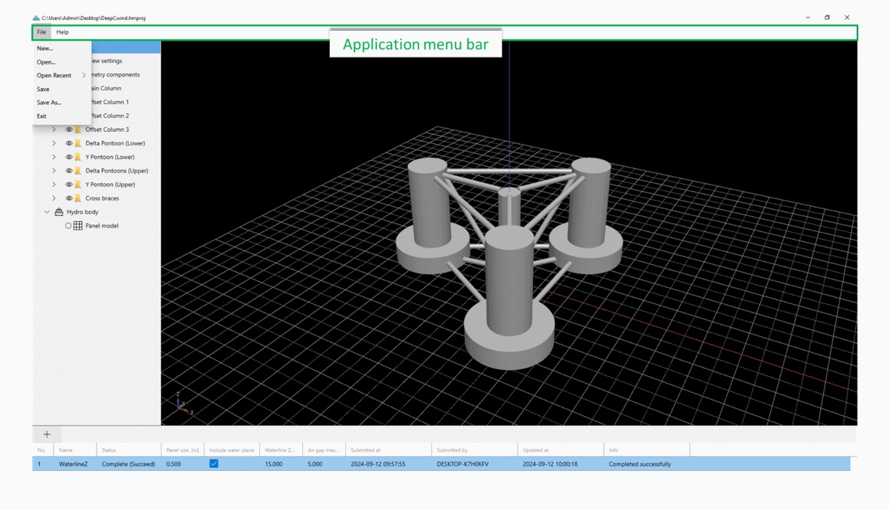
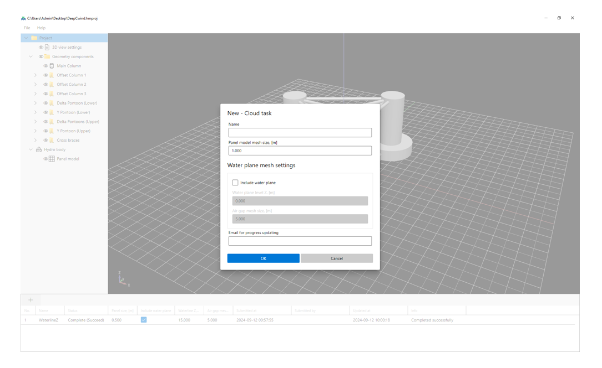



## 1 Introduction

Floating offshore structures are widely utilized across various industries, particularly in offshore oil and gas exploration. Hydrodynamic analysis plays a key role in their design, as understanding the motion, acceleration, and air gap at sea is essential for maintaining safety over a service life that can exceed 30 years. Commonly used hydrodynamic analysis software in offshore engineering includes WAMIT, SESAM, AQWA, OrcaFlex, and HydroStar. For frequency-domain analysis using the boundary element method (BEM), a panel model based on the floater's wetted hull surface is required. Typically, the geometry of floating offshore structures is relatively simple and can be modeled using a combination of basic 3D shapes such as cylinders, conical frustums, and boxes. An example of this is the floating platform structure of the OC4 DeepCwind semisubmersible.

HydroModeller is a cloud-based tool designed to streamline the creation of panel models for typical floating offshore structures. These structures are represented using a combination of basic 3D shapes, and the surface of the boolean union is extracted to generate panel models in both WAMIT GDF and SESAM FEM formats, ensuring compatibility with most hydrodynamic analysis software. Additionally, the tool can simultaneously generate the Morison model in SESAM FEM format, enabling further hydrodynamic modeling in SESAM HydroD.

## 2 User interface

The user interface consists of 5 main area, including

-	Application title bar
-	Application menu bar
-	3D model view
-	Project panel
-	Task view

### 2.1 Application title bar

Application title bar is on the top of the user interface, showing the basic information of the project, such as the path of the project file.

### 2.2 Application menu bar

Application menu bar is composed of drop-down menus that contain a list of grouped menu items for the functionality related to the application or a project.
File menu contains the functionality to create/open/save a project. The recent projects can be remembered and reopened from the Open Recent list.

The user manual, license information and the About can be found in the Help menu. 

### 2.3 3D model view

In the 3D model view, users can visualize and interact with 3D representations of basic 3D shapes, complete floating offshore structures, and their surrounding environments. This tool provides a dynamic and immersive view, allowing users to gain insights into the geometry and structural layout of the models. Users can rotate, zoom in and out, and pan across the view to examine the model from different angles and perspectives. These actions are controlled using the mouse’s left, middle, or right buttons in combination with the Ctrl, Shift, or Alt keys for enhanced functionality and navigation.

### 2.4 Project panel

The Project Panel, located on the left side of the main user interface, contains all the models and tools related to a project. This includes settings for the 3D view, geometry components, and the Hydro body (panel model), providing easy access to essential project elements for efficient navigation and management.

The Project panel is organized as a hierarchical tree structure. A symbol, either 👁 or ◯, in front of a node indicates that the object is visible/hidden in the 3D model view. All modeling functionalities can be accessed via the context menu of each node, providing quick and easy interaction with the model components.

#### 2.4.1 3D view settings

The 3D view settings manage the background visualization of the 3D model view. The XY reference plane is always visible in the 3D model view, while the YZ and XZ reference planes can be toggled on or off as needed.

#### 2.4.2 Geometry components

Geometry components folder contains all the basic and composite 3D shapes. The context menu for Geometry components is displayed below.

##### 2.4.2.1 Basic 3D shapes

The types of the basic 3D shapes include:

-	Cylinder
-	Cone frustrum
-	Box
-	Vertical prism

###### 2.4.2.1.1 Cylinder

The properties of a cylinder can be defined using the dialog box displayed below.

The checkbox for the Panel model/Morison model can be toggled to include or exclude the geometry component in the respective model. 

###### 2.4.2.1.2 Cone frustrum

The properties of a Cone frustrum can be defined using the dialog box displayed below.

The main difference between a cone frustum and a cylinder is that the cone frustum allows for the diameters of both ends of the revolving axis to be defined, whereas a cylinder has a constant diameter throughout.

###### 2.4.2.1.3 Box

A box is essentially a rectangular prism or cuboid. In HydroModeller, a box is defined by its cross-sectional width and height, along with the axis start and end points, which represent the centers of the start and end cross sections. The direction of the local Y-axis is determined by the axis direction and a reference point, while the local Z-axis direction is established based on the axis direction and local Y-axis, following the right-hand rule.

###### 2.4.2.1.4 Vertical prism
A vertical prism is defined by a horizontal polygon, the bottom Z-coordinate, and its height. The polygon is specified by a list of 2D points, which can be arranged either clockwise or counterclockwise. The cross-section is formed by creating triangles that connect the polygon's edges with the centroid of the shape.

##### 2.4.2.2 Composite shapes

HydroModeller supports 2 types of composite shape: Group and Transformation.

###### 2.4.2.2.1 Group

A Group consists of basic shapes, used to better organize geometry components or efficiently model identical structures with transformations applied. 

###### 2.4.2.2.2 Transformation

Users can duplicate all basic shapes and groups by applying a translation using the Transformation feature.

For example, if you have a cylinder in a certain position, you can use a translation to create a duplicate of this cylinder at a new location by specifying the offset (e.g., move it 5 units along the X-axis and 3 units along the Y-axis). This allows for efficient modeling of repetitive or symmetrical structures without manually recreating each shape. 

##### 2.4.2.3 Modelling with Excel

Users can utilize Excel for more advanced modeling of floating offshore structure with an Excel template file. The Excel template file can be created from the context menu of Geometry components. 

The Excel template file includes 4 sheets, each corresponding to the four basic 3D shapes: cylinder, cone frustum, box, and vertical prism. Users are allowed to input data only within designated cell regions.

Please note that only "value" type data is recognized when importing from an Excel template, while "formula" type data may not be processed correctly. If users create parametric geometry components in Excel, it is recommended to generate a separate Excel template, copy the cell values into the appropriate sheet, and import that file instead.

#### 2.4.3 Hydro body

The Hydro body and its child node, the Panel model, are used for visualizing the generated panel meshes. Additionally, panel model files in formats such as WAMIT, SESAM, HAMS, Abaqus, and AQWA can be loaded for validation purposes.

#### 2.4.4 Task view

Once all the geometry components have been modeled, a cloud task can be created in the Task view.

Users can define the mesh size for the panel model in a cloud task. By enabling the "Include water plane" option, the water plane mesh will also be generated using the same mesh size, along with a triangular mesh for air gap analysis.

Users can specify an email address to receive updates on task processing status.

A cloud task can be submitted for processing once it is created using the context menu in the task grid. The processing details can be synchronized using the same function.

The cloud task is typically processed within a few minutes. Users need to manually sync the task status. Once the result file is downloaded, the meshes can be viewed in the 3D model view.

